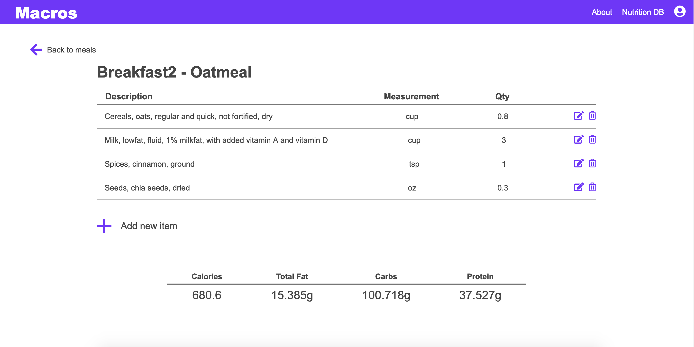

# Macros

A sample CRUD Angular app for tracking personal dietary macronutrients. Nutrition data is sourced from the [USDA Food Composition Databases](https://ndb.nal.usda.gov/ndb/search/list?home=true).

See demo [here](https://macros-f17e6.firebaseapp.com/)




## Development Setup

1. Create a new [Firebase](https://firebase.google.com/) project and store configuration details in the file src/app/api-keys.ts in the following format:

```
export const masterFirebaseConfig = {
  apiKey: "...",
  authDomain: "...",
  databaseURL: "...",
  projectId: "...",
  storageBucket: "...",
  messagingSenderId: "..."
};
```

2. Obtain a USDA Food Composition API key and store in the same file:

```
export const usdaApiKey = "...";
```

3. Run the dev server and navigate to `http://localhost:4200/`:

```
ng serve --open
```


## Build

Run `ng build` to build the project. The build artifacts will be stored in the `dist/` directory. Use the `-prod` flag for a production build.

## Running unit tests

Run `ng test` to execute the unit tests via [Karma](https://karma-runner.github.io).

## TODO Features

* Individual user accounts
* Drag and drop file tree structure
* USDA food composition database browser

## License

This project is licensed under the MIT License.
